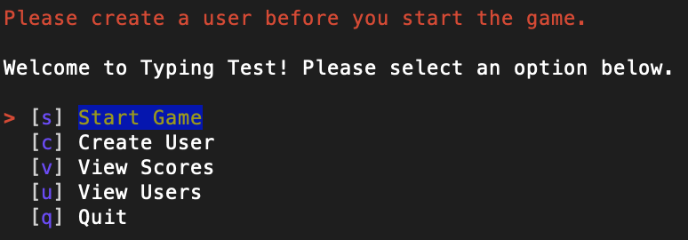
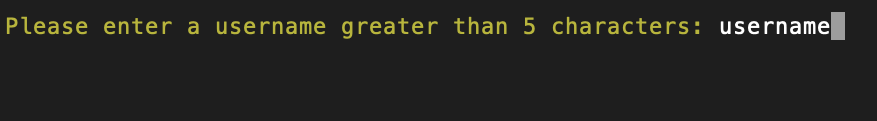
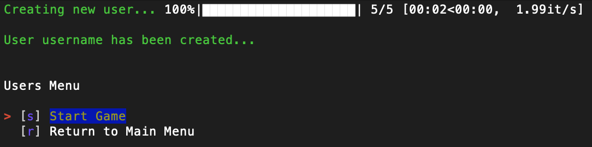
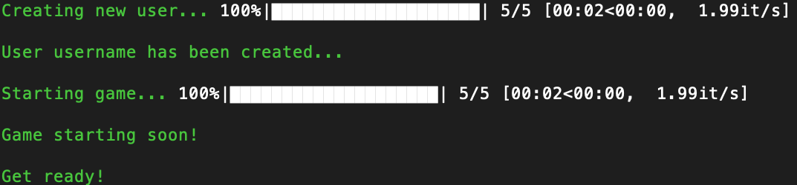
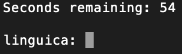
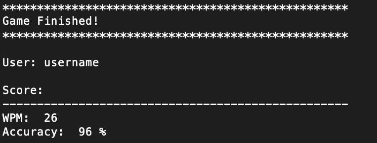

# Typing Test
### CLI Project (Python/SQL)

- Allows users to test and improve their overall typing abilities by tracking their speed and accuracy of words typed

#### Core Features

- Enables user to create a username, or log into existing user

- Allows user to play the game consisting of 60 seconds where random words are continuously given to type

- Tracks each user's score (words per minute & accuracy) and date of the game played

- Allows user to view all of the scores

- Allows user to view all of the users


***
### Running the Program

```console
$ python lib/cli.py
```

### Directory Structure

```console
.
├── Pipfile
├── Pipfile.lock
├── README.md
├── resources.db
└── lib
    ├── cli.py
    ├── classes
    │   ├── __init__.py
    │   ├── game.py
    │   ├── score.py
    │   └── user.py
    │   
    │
    └── debug.py
```
### resources.db

```
sqlite> .tables
scores  users 
```
```sql
sqlite> .schema
CREATE TABLE users(
                id INTEGER PRIMARY KEY,
                username TEXT
            );
CREATE TABLE scores(
                id INTEGER PRIMARY KEY,
                user_id INTEGER,
                wpm INTEGER,
                accuracy FLOAT,
                date TEXT,
                FOREIGN KEY (user_id) REFERENCES users (id)
            );
```
***

## How To Play:


> To start the game, a user must be created. 
> Select the Create User option or press 'c'.


> Enter a username of your choice greater than 5 and less than 15 characters.


> If the user exists, it will automatically log in as the existing user. Otherwise a new user will be created as shown above. Next, press 's' to start the game.


> Get ready to type! The game is about to start.


> The words being constantly generated, in this case "linguica," must be replicated by the user followed by the enter button to successfuly submit the attempt. "Seconds remaining" is a timer revealing how many seconds are left in the game. 


> Once the minute is up, the user receives a score report and their score is logged into the scores table. Users can also find all scores, find other users' scores by username, and view all other users using options from the main menu.

***

## Resources

- [SQLite3 in Python](https://docs.python.org/3/library/sqlite3.html)
- [Random Word API](https://api-ninjas.com/api/randomword)
- [Colorama - adding color to terminal text](https://pypi.org/project/colorama/)
- [TQDM - creating progress bars](https://github.com/tqdm/tqdm)
- [Simple Term Menu - creating terminal menus](https://pypi.org/project/simple-term-menu/)
